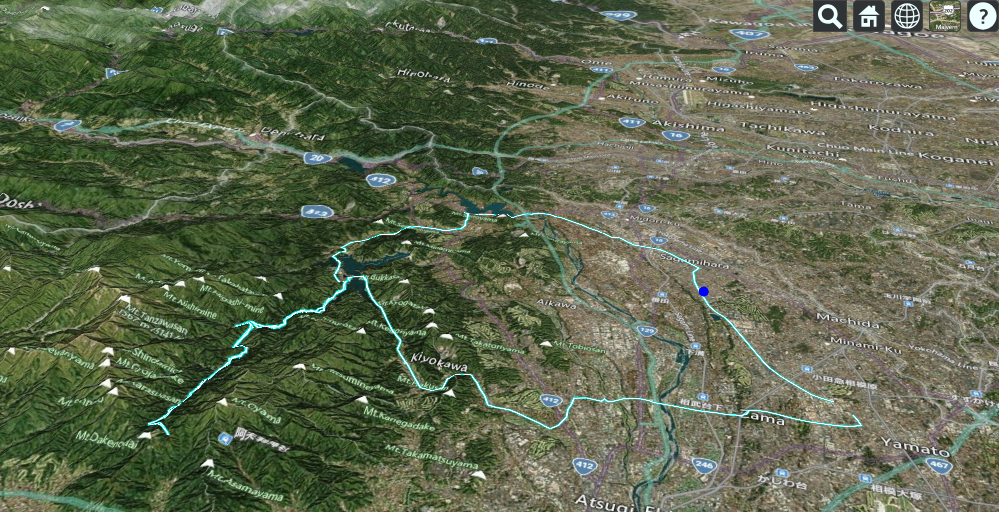

# FIT to CZML Ride Viewer

This project allows you to upload a Garmin FIT file, convert it to CZML format, and visualize your ride in 3D using CesiumJS. Built with Streamlit and designed for local use, it provides a simple and elegant way to explore your cycling data.

---

## Features

- Upload `.fit` files and parse GPS + elevation data
- Convert to CZML format with timestamped positions
- Embed CZML into a CesiumJS HTML viewer
- View animated 3D ride paths with glowing polylines
- Run locally with Docker for instant usability
- sample screen shot:



---

## Project Structure

```
./ 
├── streamlit_app.py # Streamlit frontend 
├── fit_to_czml.py # FIT to CZML converter class 
├── template.html # CesiumJS viewer template 
├── requirements.txt # Python dependencies 
├── ride_html/ # Generated HTML files 
├── Dockerfile # Container setup 
└── docker-compose.yml # Local orchestration
```

---

## Cesium Ion Access Token

This project uses CesiumJS to render 3D terrain and animations. To access Cesium's global terrain and imagery services, you need a Cesium Ion access token.

### 1. How to get a token

- Sign up at [Cesium Ion](https://cesium.com/ion/)

- Go to your dashboard and create a new access token

- Copy the token string

### 2. How to use it

- Option A: `.env` file (for local development)

```bash
CESIUM_TOKEN=your_token_here
```

- Option B: st.secrets

```toml
# .streamlit/secrets.toml
CESIUM_TOKEN = "your_token_here"
```

## Docker Setup

### 1. Build and start the container

```bash
docker-compose build
docker-compose up -d
```

### 2. Access the Streamlit app

Open your browser and go to:

```
http://localhost:8501
```

Generated HTML files are saved to /app/ride_html/

---

## Notes

- Cesium Ion access token is required. Store it in .env or st.secrets.

- This setup is optimized for local use and personal ride visualization.

- Streamlit Cloud is not recommended due to CesiumJS sandboxing limitations.

---

## License
MIT License. Use freely and modify as needed.
